# Practices, Principles, and Techniques (Hacking Flow)

**Purpose**: This document provides a structured, repeatable workflow for enumerating and exploiting services commonly found in penetration testing labs or Capture the flag (CTF) events.

**Usage**: Treat each service section as a decision map: enumerate → observe → decide → exploit → escalate. This document will be updated as new learnings are found for each service.

This document does not contain spoilers, it intentionally excludes any lab or box names.

## General Principles

- Enumeration is king: most footholds come from what I discover, not what I guess.
- Observe everything: banners, versions, error messages, directory listings, permissions, etc... Everything is a potential clue.
- Think like a decision tree: each finding should lead to a logical next step.
- Document commands, outputs, and observations—build a knowledge base and practice creating a professional write-up.
 
## Services

Below are a list of services. They are ordered alphabetically.

### DNS Overview

- Ports: TCP/UDP 53
- Purpose: Name resolution.
- Impact: Zone transfer leaks full domain map, internal hosts, and sometimes secrets.

#### Enumeration (commands)

```bash
# Nmap
nmap -p53 -sU -sV --script dns* target.thm

# dig axfr (TCP)
dig axfr @ip_address target.thm

# TXT records
dig txt target.thm
```

#### Exploitation - common paths

- AXFR success → dump entire zone; harvest internal hosts and records.
- TXT/SRV records revealing configuration secrets or service endpoints.

#### Observation cues

- Authoritative vs recursive behavior.
- Internal naming conventions (dev, staging, vpn, db, etc..).

#### Decision triggers

- AXFR allowed → pivot immediately to targeted host enumeration.
- AXFR denied → try specific subdomains or misconfigurations on secondary servers.

#### Common pitfalls and time-savers

- Skipping TCP scans; AXFR requires TCP 53.
- Ignoring TXT records for secrets/keys.

#### Privilege escalation tie-ins

- Hostnames enable precise targeting for SMB/RDP/SSH and web subservices.

#### Automation ideas

- Automate subdomain brute-force and AXFR attempts against suspected name servers.

#### Attack flow

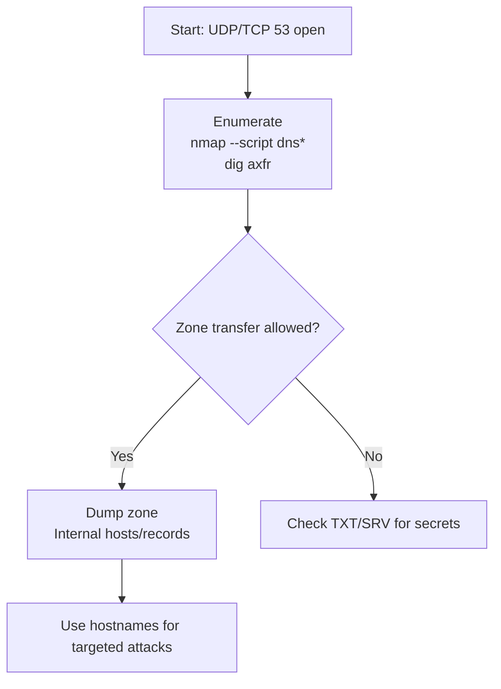

### FTP Overview

- Port: 21
- Purpose: File transfer.
- Impact: Anonymous or writable paths can reveal credentials or enable cross-service remote code execution (RCE).

#### Enumeration (commands)

```bash
# Nmap
nmap -p21 -sV --script ftp* target.thm

# Anonymous login
ftp target.thm
Name: anonymous
Password: (blank or email)

# Hidden files
ls -la
```

#### Exploitation - common paths

- Anonymous read → harvest backups, configurations, and keys.
- Anonymous write → upload test; if mapped to webroot, leverage for remote code execution (RCE).
- Version-specific CVEs (vsftpd/ProFTPD).

#### Observation cues

- Server type/version banner (vsftpd/ProFTPD/Pure-FTPd).
- Writable directories, could be used for RCE.
- Hidden files and archives (.zip/.tar).

#### Decision triggers

- Anonymous allowed → enumerate files and directories; then test cross-service credentials.
- Writable path → verify if uploads become accessible via other services.

#### Common pitfalls and time-savers

- Skipping passive mode and failing transfers.
- Missing hidden files by not using `ls -la`.

#### Privilege escalation tie-ins

- Extracted credentials/keys used on SSH/SMB/DB.
- Deployment/backup scripts revealing sudoers or service accounts.

#### Automation ideas

- Recursive listing and keyword grep (password=, aws_access_key_id, id_rsa, etc...).
- Test-upload script that checks external service accessibility.

#### Attack flow

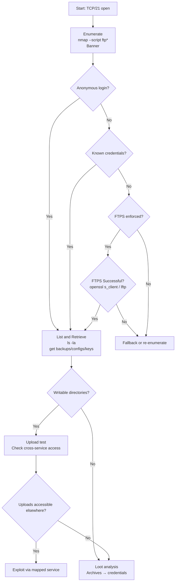

### LDAP Overview

- Ports: TCP 389 (LDAP), 636 (LDAPS), 3268/3269 (Global Catalog)
- Purpose: Directory services (often Active Directory).
- Impact: User/group enumeration; sometimes passwords or secrets in attributes; enables targeted credential attacks and AD-specific techniques.

#### Enumeration (commands)

```bash
# Nmap
nmap -p389,636,3268,3269 -sV --script ldap* target.thm

# Anonymous/simple bind test
ldapsearch -x -H ldap://target.thm -b "DC=example,DC=local" "(objectClass=*)" -LLL

# Authenticated bind (if creds)
ldapsearch -H ldap://target.thm -D "user@example.local" -w '<pass>' -b "DC=example,DC=local" '(sAMA

# LDAPS / StartTLS
ldapsearch -ZZ -H ldap://target.thm -b "DC=example,DC=local" '(objectClass=user)'
```

### Exploitation – common paths

- Anonymous bind allowed → dump naming contexts, users, groups, computers.
- Authenticated bind → enumerate attributes (mail, description, userAccountControl, lastLogon).
- Harvest servicePrincipalName (SPN) values for targeted service accounts (prep for Kerberoasting via Kerberos, outside LDAP).
- Sometimes credentials or API keys are stored in description/comment attributes.

#### Observation cues

- Naming contexts (defaultNamingContext, rootDomainNamingContext).
- Supported controls and SASL mechanisms; StartTLS capability.
- Attribute hygiene (description, info, servicePrincipalName, userPrincipalName).

#### Decision triggers

- Anonymous bind works → build high-confidence username list before any guessing.
- No anonymous bind → use usernames from SMTP/DNS/SMB and try simple bind with careful rate limits.
- LDAPS/StartTLS available → prefer encrypted binds.

#### Common pitfalls and time-savers

- Wrong base DN causing empty results.
- Mixing DOMAIN\user vs user@domain formats inconsistently.
- Ignoring Global Catalog (3268/3269) for forest-wide queries.

#### Privilege escalation tie-ins

- Use enumerated users for precise SMB/RDP logins; map group memberships for privilege expectations.
- Look for delegated/admin accounts and service accounts linked to machines you can reach.Automation ideas
- Scripted ldapsearch wrappers to export CSV of users/groups and key attributes.
- Automated parsing for SPNs and description fields to surface potential secrets.

#### Attack flow

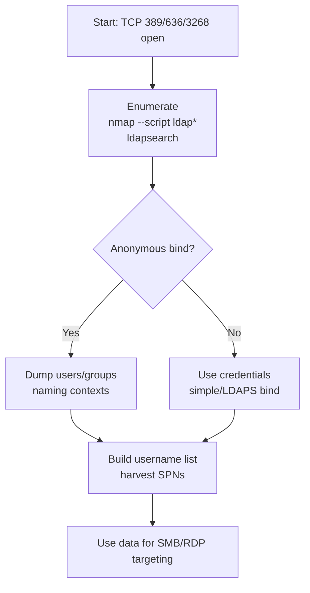

### NFS Overview

- Ports: TCP/UDP 2049.
- Purpose: Unix file sharing.
- Impact: Misconfigured exports allow mounting sensitive directories; root-squash issues can be severe.

#### Enumeration (commands)

```bash
# Nmap
nmap -p2049 --script nfs* target.thm

# showmount
showmount -e target.thm
```

#### Exploitation – common paths
- Exports found → mount and loot configs, SSH keys, backups.
- Writable export and improper root-squash → potential root-level writes.

#### Observation cues

- Exported paths and permissions (ro/rw).
- Root-squash status and UID/GID mappings.

#### Decision triggers

- Readable export → harvest immediately; search for credentials.
- Writable export → test controlled writes; check propagation to other services.

#### Common pitfalls and time-savers

- Not checking root-squash rules.
- Leaving mounts open (operational hygiene).

#### Privilege escalation tie-ins

- Looted keys/configurations → SSH/SMB/DB access; service configurations reveal sudoers and paths.

#### Automation ideas

- Script to mount all exports read-only, copy, and grep for credential-shaped strings.

#### Attack flow

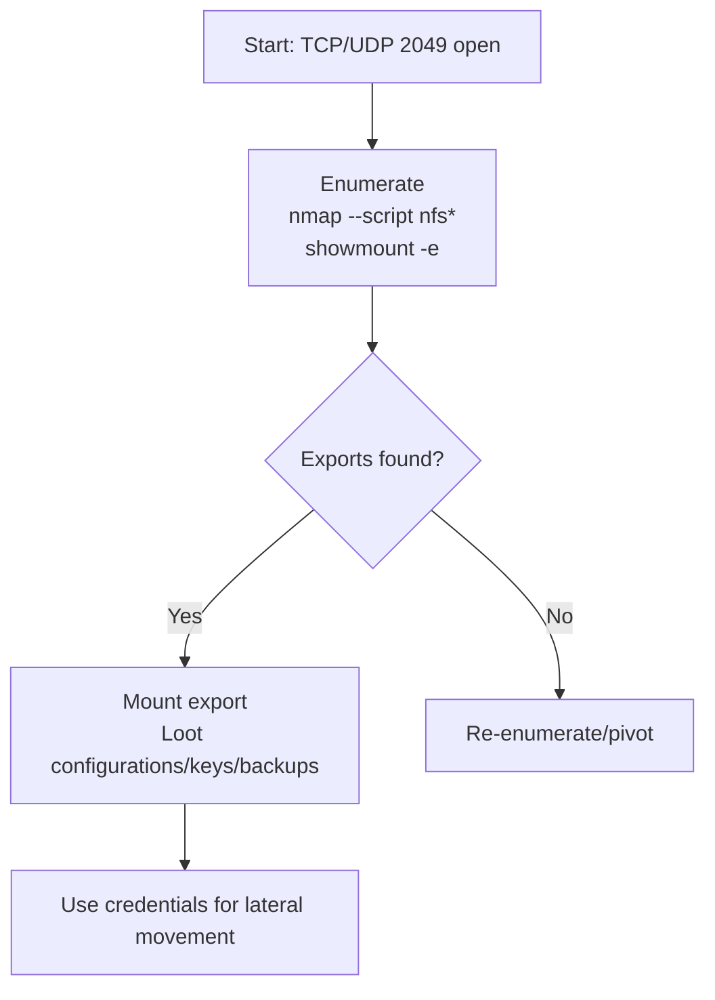

### RDP Overview

- Ports: TCP 3389.
- Purpose: Remote desktop for Windows hosts.
- Impact: Direct interactive access; weak credentials or misconfigured NLA can enable compromise and lateral movement.

#### Enumeration (commands)

```bash
# Nmap
nmap -p3389 -sV --script rdp* target.thm

# Security and NLA info
nmap -p3389 --script rdp-enum-encryption,rdp-ntlm-info target.thm

# Credential testing (use caution)
crackmapexec rdp target.thm -u <user> -p <pass>

# Manual connect
xfreerdp /v:<IP> /u:<user> /p:<pass> /cert:ignore

# Pass-the-Hash (when supported)
xfreerdp /v:<IP> /u:<user> /pth:<NTLM_hash> /cert:ignore
```

#### Exploitation – common paths

- Valid creds → full desktop; pivot to WinRM/SMB, dump secrets, run tools.
- NLA disabled on old systems → test weaker auth paths; check for TLS downgrade.
- Leverage credentials from SMB/LDAP/kerberoasting for targeted login attempts.
- Old/RDP service CVEs on unpatched systems (e.g., BlueKeep on legacy hosts).

#### Observation cues

- NLA on/off; security protocol (Standard RDP/TLS/CredSSP).
- Server OS/version via banners (rdp-ntlm-info).
- Account lockout policies; domain vs local accounts.

#### Decision triggers

- NLA enabled → avoid brute force; focus on curated credential testing.
- NLA disabled → still rate-limit attempts; verify encryption settings.
- Domain environment → prefer domain-format logins (DOMAIN\user or user@domain.local).

#### Common pitfalls and time-savers

- Triggering account lockouts with aggressive guessing.
- Ignoring certificate warnings and channel security (clipboard/drive).

#### Privilege escalation tie-ins

- Once logged in: check local admin groups, scheduled tasks, saved credentials, mapped drives.
- Use WinRM/SMB for stealthy command execution and file transfer after initial RDP foothold.

#### Automation ideas

- Credential-reuse sweeps across RDP/WinRM/SMB with back-off timers.
- rdp-enum automation to record NLA/encryption posture per host.

#### Attack flow

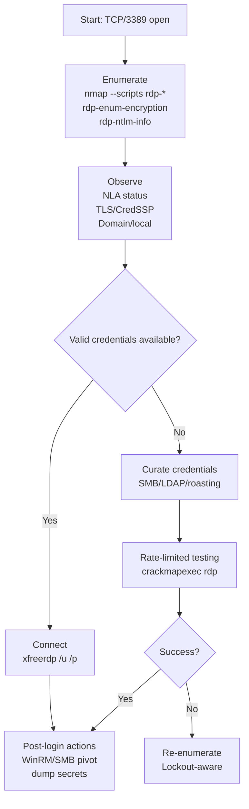

### SMB Overview

- Ports: 139/445
- Purpose: File/printer sharing, RPC.
- Impact: Readable/writable shares expose sensitive data; valid credentials enable lateral movement.

#### Enumeration (commands)

```bash
# Nmap
nmap -p445 --script smb-enum-shares,smb-enum-users target.thm

# enum4linux
enum4linux -a target.thm

# smbclient
smbclient -L //target.thm -N
smbclient //target.thm/found_share -N

# Credential verification
crackmapexec smb target.thm -u <user> -p <pass>
```

#### Exploitation – common paths

- Anonymous/null session → list shares, download configurations/keys.
- Valid credentials → remote exec (psexec/wmi/smbexec) per OS/hardening.
- Legacy OS/version → investigate kernel/RPC vulnerabilities.

#### Observation cues

- Share names/ACLs; custom departmental shares (finance/dev/hr).
- OS fingerprint (helps choose technique).
- Presence of writable script paths/logon scripts.

#### Decision triggers

- Anonymous read → loot first; parse for credentials and secrets.
- Creds validated → choose appropriate remote exec to avoid noise.
- No users → expand recon via SMTP/LDAP/DNS to harvest usernames.

#### Common pitfalls and time-savers

- Skipping RPC enumeration and null sessions.
- Noisy brute force instead of targeted credential use.

#### Privilege escalation tie-ins

- AD memberships/GPO/script paths; saved credentials in profiles.
- Deploy staged binaries via writable shares if policy permits.

#### Automation ideas

- Automated share listing and keyword grep across downloaded files.
- Credential reuse tester across SMB/RDP/WinRM.

#### Attack flow

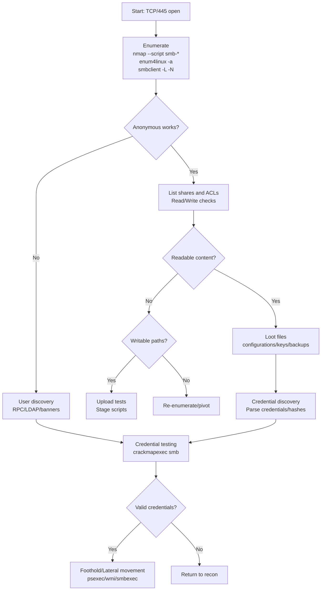

### SMTP Overview

- Port: 25/465/587
- Purpose: Email relay.
- Impact: Username harvesting; rare open relay abuse; headers revealing infrastructure.

#### Enumeration (commands)

```bash
# Nmap
nmap -p25,465,587 -sV --script smtp* target.thm

# Banner/Commands
nc target.thm 25
VRFY user
EXPN list
```

#### Exploitation - common paths

- VRFY/EXPN supported → harvest usernames for credential attacks on SSH/SMB.
- STARTTLS presence → consider TLS downgrade assessments in advanced scenarios.
- Misrouted mail directories or scripts in mail paths (edge cases) for execution.

#### Observation cues

- Mail server type/version (Postfix/Exim/Sendmail).
- VRFY/EXPN behavior and error strings.
- Submission/SMTPS configurations (465/587).

#### Decision triggers

- VRFY returns valid users → build user list and pause brute force until credentials are found.
- No VRFY/EXPN → pivot to other services for user discovery (LDAP/DNS/SMB).

#### Common pitfalls and time-savers

- Expecting open relay in modern environments.
- Ignoring STARTTLS capabilities and TLS policy.

#### Privilege escalation tie-ins

- Harvested usernames fuel targeted credential testing across SSH/SMB/RDP.

#### Automation ideas

- Automate VRFY sweeps using wordlists of common names and map outputs.

#### Attack flow

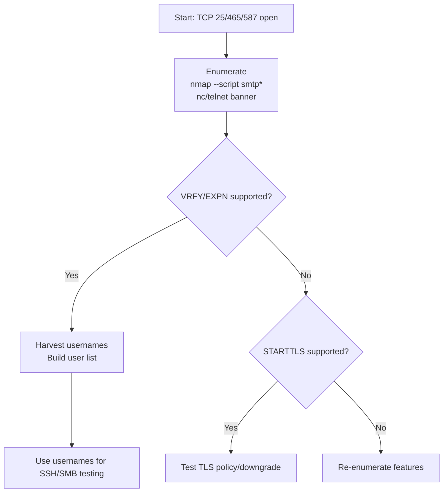

### SNMP Overview

- Port: 161/162
- Purpose: Device monitoring.
- Impact: Default community strings expose OS, processes, interfaces, and sometimes credentials.

#### Enumeration (commands)

```bash
# Nmap
nmap -p161 -sU --script snmp* target.thm

# snmpwalk
snmpwalk -v2c -c public target.thm
```

#### Exploitation - common paths

- Valid community string → dump system information, running processes, and interfaces.
- Credential discovery via specific OIDs and application configurations exposed via SNMP.

#### Observation cues

- SNMP version (v1/v2c insecure; v3 encrypted/authenticated).
- Strings like 'public'/'private' working; custom strings in banners/docs.

#### Decision triggers

- Community string valid → parse for credentials and target processes/services.
- String invalid → try common defaults, then move on to other vectors.

#### Common pitfalls and time-savers

- Forgetting UDP scan entirely.
- Not checking v3 (might hide useful data but more secure).

#### Privilege escalation tie-ins

- Cleartext credentials → SSH/SMB access; process information guides targeted privilege escalation.

#### Automation ideas

- Automated snmpwalk parsers to extract key OIDs and credential-like strings.

#### Attack flow
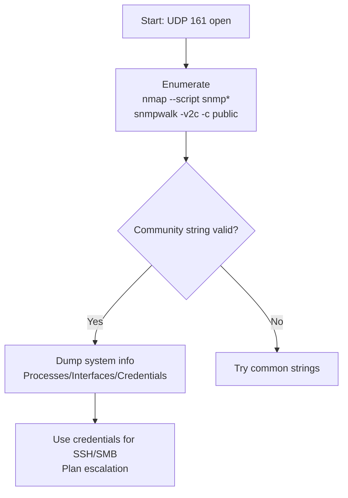

### SSH Overview

- Port: 22
- Purpose: Used for remote administration.
- Impact: Direct system access if misconfigured or weakly credentialed.

#### Enumeration (commands)

```bash
# Nmap
nmap -p22 -sV --script ssh* target.thm

# Banner
nc target.thm 22

# Credential tests (rate-aware)
hydra -L users.txt -P passwords.txt shh://target.thm
ssh -i id_rsa user@target.thm
```

#### Exploitation - common paths

- Weak/default credentials; due to the slow login speed of SSH, prioritize targeted credentials over blind brute force.
- Leaked private keys in shares/backups; test with `ssh -i`.
- Version-specific hardening gaps; review changelogs/CVEs for old OpenSSH versions.
 
#### Observation cues

- Banner and exact version string.
- Authentication modes (password vs key).
- Usernames discovered via other services (SMTP/SMB/DNS).
 
#### Decision triggers

- Password auth ON → focus on credential discovery before brute forcing.
- Key-only → broaden hunt for private keys/authorized_keys exposure.
- Restricted shell → try scp/sftp, check `sudo -l` and writable paths.

#### Common pitfalls and time-savers

- Brute forcing when password auth is disabled.
- Ignoring rate limits/lockouts; prefer manual targeted attempts.
 
#### Privilege escalation tie-ins

- `sudo -l` misconfigs (NOPASSWD, specific command escapes).
- SUID binaries, writable service scripts, and cron jobs.
- Credentials in /etc and user home directories.
 
#### Automation ideas

- Scripted recon to parse version strings into a CVE notes file.
- Auto-test discovered credentials on SSH carefully with delays.
 
#### Attack flow

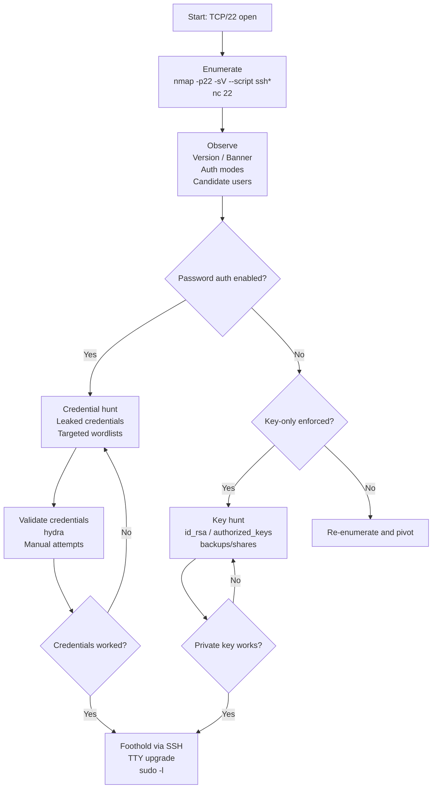

### Telnet Overview

- Ports: TCP 23
- Purpose: Legacy remote shell.
- Impact: Cleartext credentials; often found on embedded/network gear with default credentials.

#### Enumeration (commands)

```bash
# Nmap
nmap -p23 -sV --script telnet* target.thm

# Banner and prompt
nc target.thm 23

# Credential testing (slow and careful)
hydra -L users.txt -P passwords.txt telnet://target.thm
```

#### Exploitation – common paths

- Default/weak credentials → interactive shell.
- Backdoor/debug accounts on appliances; try vendor defaults.
- If shell obtained → drop to busybox/cmd and enumerate filesystem for configs/keys.

#### Observation cues

- Login prompt banner (device/vendor/OS).
- Negotiation strings; terminal options.
- Privilege level after login (user vs enable/admin).

#### Decision triggers

- Prompt present → attempt targeted credentials first (from SMTP/LDAP/SMB).
- No prompt or closed after banner → check ACLs or IP restrictions.

#### Common pitfalls and time-savers

- Brute forcing aggressively → easy lockouts or network alarms.
- Forgetting Telnet is cleartext; avoid leaking your own creds; use isolated lab nets.

#### Privilege escalation tie-ins

- Escalate via local privilege mechanisms (enable, sudo, su).
- Harvest configs for credentials to pivot (SSH/DB/SMB).

#### Automation ideas

- Automate vendor default credential tests with rate-limits.

#### Attack flow
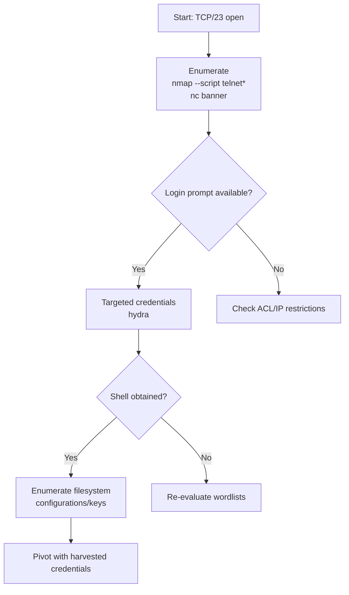

### VNC Overview

- Ports: TCP 5900+ (per display: 5900, 5901, ...)
- Purpose: Remote desktop sharing.
- Impact: Weak/empty passwords or no authentication can allow full desktop viewing/control.

#### Enumeration (commands)

```bash
# Nmap
nmap -p5900-5910 -sV --script vnc-info,vnc-title,vnc-auth target.thm

# Manual connect
vncviewer target.thm:<display>

# Credential testing (short, careful)
hydra -P passwords.txt -s 5900 vnc://target.thm

# Screenshot
vncsnapshot target.thm:<display> out.png
```

#### Exploitation – common paths

- No auth or weak password → immediate desktop access.
- View-only mode still leaks sensitive information (files, configs, tokens).
- Use desktop access to open terminals or RDP/SSH clients for deeper control.

#### Observation cues

- Security types (VNC auth, TLS).
- Display number mapping (port-5900).
- Server banner/version (RealVNC/TightVNC/TigerVNC).

#### Decision triggers

- Authentication required → test curated passwords (from loot).
- No authentication → connect and immediately begin evidence collection and pivot setup.

#### Common pitfalls and time-savers

- Trying only 5900 and missing other displays (5901+).
- Leaving sessions open (risk and noise).

#### Privilege escalation tie-ins

- Harvest files/secrets and enable additional remote services (RDP/SSH).
- Check saved credentials in browsers and password managers.

#### Automation ideas

- Automate screenshot capture across displays to triage hosts quickly.

#### Attack flow

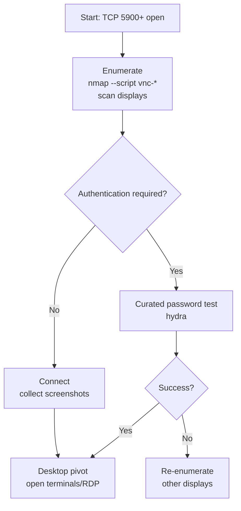
